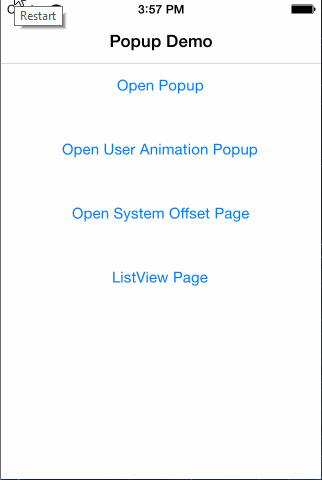

# Popup Page Plugin for Xamarin Forms
The plugin allows you to open any page as a popup.

Nuget: https://www.nuget.org/packages/Rg.Plugins.Popup/

 

## Support platforms

- [x] Android
- [x] iOS
- [ ] WinPhone (v1.0.0-pre1)
- [ ] UWP (v1.0.0-pre1)

Prerelease supported WinPhone and UWP: https://www.nuget.org/packages/Rg.Plugins.Popup/1.0.0-pre1

## Support Events

* OnAppearing
* OnDisappearing
* OnBackButtonPressed
* BackgroundClicked: Called when clicked on background 

## Animations

#### Fade Animation

* Fade

#### Scale Animation

* ScaleCenterUp
* ScaleTopUp
* ScaleTopBottomUp
* ScaleBottomUp
* ScaleBottomTopUp
* ScaleLeftUp
* ScaleLeftRightUp
* ScaleRightUp
* ScaleRightLeftUp
* ScaleCenterDown
* ScaleTopDown
* ScaleTopBottomDown
* ScaleBottomDown
* ScaleBottomTopDown
* ScaleLeftDown
* ScaleLeftRightDown
* ScaleRightDown
* ScaleRightLeftDown

#### Move Animation

* MoveTop
* MoveTopBottom
* MoveBottom
* MoveBottomTop
* MoveLeft
* MoveLeftRight
* MoveRight
* MoveRightLeft

## Initialize

#### Android 

Not required

#### iOS

```csharp
public partial class AppDelegate : global::Xamarin.Forms.Platform.iOS.FormsApplicationDelegate
{
    public override bool FinishedLaunching(UIApplication app, NSDictionary options)
    {
        Rg.Plugins.Popup.IOS.Popup.Init(); // Init Popup
        
        global::Xamarin.Forms.Forms.Init();
        LoadApplication(new App());
        return base.FinishedLaunching(app, options);
    }
}
```

## PopupPage Properties

* BackgroundColor: Hex #80FF5C5C where #80 opacity [Range](http://stackoverflow.com/questions/5445085/understanding-colors-in-android-6-characters/11019879#11019879)
* IsBackgroundAnimating
* IsAnimating
* IsCloseOnBackgroundClick: Close pop-up when click on the background
* AnimationName: In default animations
* IsSystemPadding: Enabled/Disabled system padding offset (Only for Content not for Background)
	
	 
* SystemPadding: (ReadOnly) Thickness

## How Use

```xml
<?xml version="1.0" encoding="utf-8" ?>
<pages:PopupPage xmlns="http://xamarin.com/schemas/2014/forms"
             xmlns:x="http://schemas.microsoft.com/winfx/2009/xaml"
             xmlns:pages="clr-namespace:Rg.Plugins.Popup.Pages;assembly=Rg.Plugins.Popup"
             x:Class="Demo.Pages.MyPopupPage">
  <!-- Content -->
</pages:PopupPage>
```
```csharp
public partial class MyPopupPage : PopupPage
    {
        public SecondPopupPage()
        {
            InitializeComponent();
        }

        protected override void OnAppearing()
        {
            base.OnAppearing();
        }

        protected override void OnDisappearing()
        {
            base.OnDisappearing();
        }

        protected override bool OnBackButtonPressed()
        {
            // Prevent hide popup
            //return base.OnBackButtonPressed();
            return true; 
        }
    }
    
    // Main Page
    
    public partial class MainPage : ContentPage
    {
        public MainPage()
        {
            InitializeComponent();
        }
        
        // Button Click
        private async void OnOpenPupup(object sender, EventArgs e)
        {
            var page = new MyPopupPage();
            
            await Navigation.PushPopupAsync(page);
            // or
            PopupNavigation.PushAsync(page);
        }
    }
```

## User Animation

```csharp
    // User animation
    class UserAnimation : IPopupAnimation
    {
        // Call Before OnAppering
        public void Preparing(View content, PopupPage page)
        {
            // Preparing content and page
            content.Opacity = 0;
        }

		// Call After OnDisappering
        public void Disposing(View content, PopupPage page)
        {
			// Dispose Unmanaged Code
        }
        
        // Call After OnAppering
        public async Task Appearing(View content, PopupPage page)
        {
            // Show animation
            await content.FadeTo(1);
        }
        
        // Call Before OnDisappering
        public async Task Disappearing(View content, PopupPage page)
        {
            // Hide animation
            await content.FadeTo(0);
        }
    }
    
    // Popup Page
    public partial class UserPopupPage : PopupPage
    {
        public SecondPopupPage()
        {
            InitializeComponent();
            Animation = new UserAnimation();
        }
    }
```

## Thanks

* [xam-forms-transparent-modal](https://github.com/gaborv/xam-forms-transparent-modal)

## License

The MIT License

Permission is hereby granted, free of charge, to any person obtaining a copy
of this software and associated documentation files (the "Software"), to deal
in the Software without restriction, including without limitation the rights
to use, copy, modify, merge, publish, distribute, sublicense, and/or sell
copies of the Software, and to permit persons to whom the Software is
furnished to do so, subject to the following conditions:

The above copyright notice and this permission notice shall be included in
all copies or substantial portions of the Software.

THE SOFTWARE IS PROVIDED "AS IS", WITHOUT WARRANTY OF ANY KIND, EXPRESS OR
IMPLIED, INCLUDING BUT NOT LIMITED TO THE WARRANTIES OF MERCHANTABILITY,
FITNESS FOR A PARTICULAR PURPOSE AND NONINFRINGEMENT. IN NO EVENT SHALL THE
AUTHORS OR COPYRIGHT HOLDERS BE LIABLE FOR ANY CLAIM, DAMAGES OR OTHER
LIABILITY, WHETHER IN AN ACTION OF CONTRACT, TORT OR OTHERWISE, ARISING FROM,
OUT OF OR IN CONNECTION WITH THE SOFTWARE OR THE USE OR OTHER DEALINGS IN
THE SOFTWARE.
